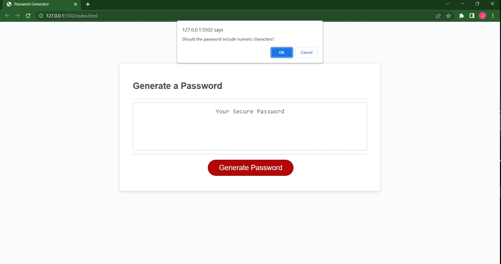

<h1 align="center">Jon Kelly's Password Generator's ReadMe</h1>

<!-- ABOUT THE PROJECT -->
## About The Project

This assignment for this challenge was to create a working password generator that:

 Asked what type of characters should be included in the password through pop up prompts and not work unless at least one is selected:
    lowercase
    uppercase
    numeric
    special characters

should ask what the length of the password should be (between 8 and 128)

then generate a random string of the selected characters based on user input criteria

 
Extra

The reason I used .push() instead of .concat() was through working with a tutor. The .push() also explains the extra line of math I added to my for loop in order to combine everything into a dynamic array. I now know I could have used concat and a single line of math, but both solutions worked, and i liked this one

<!-- Links -->
## Links

Deployed application:
https://j0nk-le.github.io/challenge3/

Project Link:
https://github.com/J0nK-LE/challenge3

